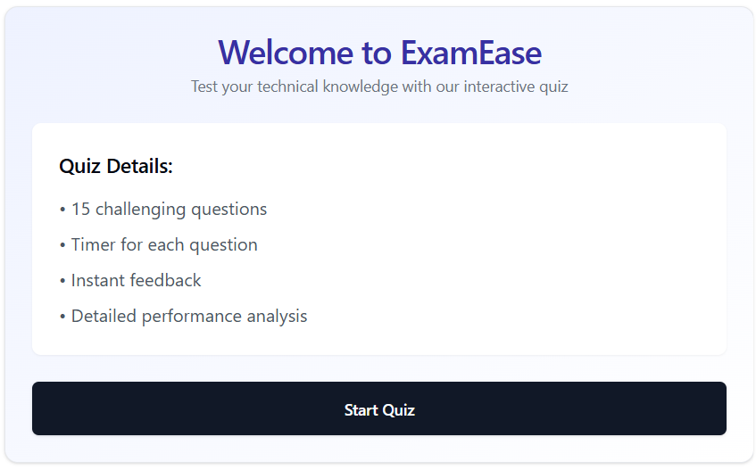

# ExamEase Quiz Component


# ExamEase Quiz Application

A modern, interactive quiz application built with React that tests technical knowledge across various programming and web development topics. The application features real-time feedback, detailed explanations, and comprehensive performance analytics.

## 🌟 Features

- 15 technical questions across multiple categories
- Real-time countdown timer for each question
- Instant feedback and detailed explanations
- Interactive category-based performance tracking
- Visual analytics with pie charts
- Personalized improvement recommendations
- Responsive design
- Progress tracking
- Mobile-friendly interface

## 🚀 Getting Started

### Prerequisites

- Node.js (v14 or higher)
- npm or yarn
- React (v17 or higher)

### Required Dependencies

```bash
npm install recharts @/components/ui/card tailwindcss
```

### Installation

### Installation

1. Clone the repository:
```bash
git clone https://github.com/NishantKumar-CSE/Ease_Exam_DevQuest.git
cd Ease_Exam_DevQuest
```

2. Install dependencies:
```bash
npm install
```

3. Start the development server:
```bash
npm run dev
```

## 📚 Quiz Structure

The quiz consists of questions from the following categories:
- Web Development
- Web Security
- Development Tools
- Data Structures
- Algorithms
- Web Infrastructure
- Databases

Each question includes:
- Multiple choice options
- Time limit
- Detailed explanation
- Category classification

## 🎨 UI Components

1. **ProgressBar**
   - Shows quiz completion progress
   - Customizable color scheme

2. **Question Display**
   - Category indicator
   - Question counter
   - Timer display

3. **Results Dashboard**
   - Overall score
   - Category-wise performance pie chart
   - Detailed analysis
   - Improvement recommendations

## 🛠️ Technical Implementation

### Key Features Implementation

1. **Timer System**
```javascript
useEffect(() => {
  if (timeLeft > 0 && !answered) {
    const timer = setInterval(() => {
      setTimeLeft((prev) => prev - 1);
    }, 1000);
    return () => clearInterval(timer);
  }
}, [timeLeft, answered]);
```

2. **Score Tracking**
```javascript
const handleAnswerSubmit = (selectedIndex) => {
  if (!answered) {
    const correct = selectedIndex === quizData[currentQuestion].correct;
    if (correct) {
      setScore(score + 1);
      // Update category scores
      setCategoryScores(prev => ({
        ...prev,
        [currentCategory]: (prev[currentCategory] || 0) + 1
      }));
    }
  }
};
```

## 📊 Analytics Features

The application provides:
- Overall score percentage
- Category-wise performance breakdown
- Visual representation through pie charts
- Personalized recommendations based on performance

## 🎯 Performance Analysis

The system analyzes performance in three tiers:
1. **Excellent** (>75% correct)
2. **Good** (50-75% correct)
3. **Needs Improvement** (<50% correct)

## 🔧 Customization

### Adding New Questions

Add new questions to the `quizData` array following this format:
```javascript
{
  question: "Your question here?",
  options: ["Option 1", "Option 2", "Option 3", "Option 4"],
  correct: 0, // Index of correct answer
  timeLimit: 30, // Time in seconds
  category: "Category Name"
}
```

### Modifying Styles

The application uses Tailwind CSS for styling. Customize the appearance by:
1. Modifying the existing Tailwind classes
2. Adding new styles in your CSS file
3. Adjusting the color schemes in the component

## 📱 Responsive Design

The application is fully responsive and works across:
- Desktop browsers
- Tablets
- Mobile devices

## 🤝 Contributing

1. Fork the repository
2. Create your feature branch (`git checkout -b feature/AmazingFeature`)
3. Commit your changes (`git commit -m 'Add some AmazingFeature'`)
4. Push to the branch (`git push origin feature/AmazingFeature`)
5. Open a Pull Request

## 📝 License

This project is licensed under the MIT License - see the LICENSE file for details.

## 👥 Authors

- Your Name - Initial work

## 🙏 Acknowledgments

- React team for the amazing framework
- Recharts for the charting library
- Tailwind CSS for the styling utility classes
