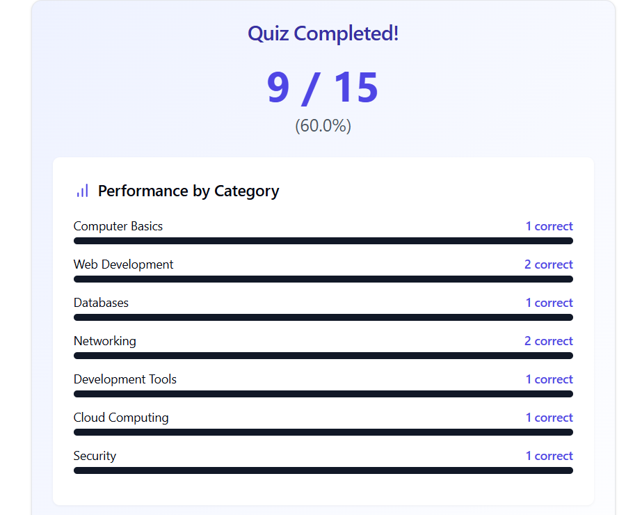

# ExamEase Quiz Component


ExamEase is a React-based quiz component designed to test technical knowledge through an interactive and engaging interface. This component includes features such as a timer for each question, instant feedback, and detailed performance analysis.

## Early Access
- Link (CLICK HERE): https://claude.site/artifacts/78307c5a-e7b6-4b47-8cb6-9f9a43441f65

## Features


- **Interactive Quiz**: Engage users with a series of questions and options.
- **Timer**: Each question has a time limit to add a challenge.





-**Instant Feedback**: Immediate feedback on whether the selected answer is correct or incorrect.
- **Performance Analysis**: Detailed analysis of performance by category.
- **Responsive Design**: Adapts to different screen sizes for a seamless user experience.

## Installation

To use the ExamEase component in your project, follow these steps:

1. **Clone the Repository**:
   ```bash
   git clone <repository-url>
   cd exam-ease
   ```
2. **Install Dependencies**:
   ```bash
   npm install
   ```
3. **Run the Application**:
   ```bash
   npm start
   ```

## Usage

Import the ExamEase component into your application and use it as follows:

```javascript
import React from 'react';
import ReactDOM from 'react-dom';
import ExamEase from './ExamEase';

ReactDOM.render(<ExamEase />, document.getElementById('root'));
```

## Component Structure

- **Quiz Data**: An array of objects containing questions, options, correct answers, time limits, and categories.
- **State Management**: Uses React's `useState` and `useEffect` hooks to manage the quiz state, including the current question, score, selected answer, time left, and more.
- **Styling**: Utilizes Tailwind CSS for styling and responsive design.

## Customization

You can customize the quiz data, styles, and other properties to fit your needs. The quiz data is defined in the `quizData` array, and styles can be modified using Tailwind CSS classes.

## Contributing

Contributions are welcome! Please open an issue or submit a pull request.

## License

This project is licensed under the MIT License.

